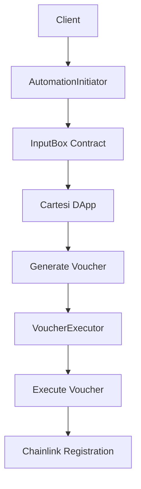

# Cartesi Chainlink Automation Library

A TypeScript library that simplifies Chainlink Automation upkeep registration for Cartesi DApps through a two-part asynchronous workflow.

## Overview

This library bridges the gap between Cartesi's off-chain computation environment and Chainlink's on-chain automation services. It provides a clean, developer-friendly API for registering automation upkeeps that can trigger actions in your Cartesi DApp.

### Key Features

- **Two-part Architecture**: Separate initiation and execution phases for maximum flexibility
- **TypeScript Support**: Full type safety and IntelliSense support
- **Multi-network Support**: Works across Ethereum, Polygon, Base, Arbitrum, and their testnets
- **Comprehensive Error Handling**: Custom error types for better debugging
- **GraphQL Integration**: Seamless polling of Cartesi's GraphQL API for vouchers
- **Gas Optimization**: Automatic gas estimation with configurable buffers

## Architecture

The library implements a two-part workflow to handle the asynchronous nature of Cartesi DApps:

1. **AutomationInitiator**: Sends registration requests to your Cartesi DApp via the InputBox contract
2. **VoucherExecutor**: Polls for and executes the resulting vouchers that contain the actual Chainlink registration calls



## Installation

```bash
npm install cartesi-chainlink-automation
```

## Quick Start

### Basic Usage

```typescript
import { ethers } from "ethers";
import { createAutomationRegistration } from "cartesi-chainlink-automation";

// Set up your provider and signer
const provider = new ethers.providers.JsonRpcProvider("https://sepolia.infura.io/v3/YOUR_KEY");
const signer = new ethers.Wallet("YOUR_PRIVATE_KEY", provider);

// Register automation in one call
const result = await createAutomationRegistration(signer, {
  dappAddress: "0x...", // Your Cartesi DApp address
  upkeepContract: "0x...", // Your AutomationCompatible contract
  name: "My DApp Automation",
  gasLimit: 500000,
  adminAddress: "0x...", // Address that will manage the upkeep
  amount: ethers.utils.parseEther("10").toString(), // 10 LINK in wei
}, "http://localhost:8080/graphql"); // Your Cartesi GraphQL endpoint

console.log("Registration completed:", result);
```

### Advanced Usage (Two-Part Workflow)

```typescript
import { AutomationInitiator, VoucherExecutor } from "cartesi-chainlink-automation";

// Phase 1: Initiate the registration
const initiator = new AutomationInitiator(signer);
await initiator.initialize();

const initiation = await initiator.initiateRegistration({
  dappAddress: "0x...",
  upkeepContract: "0x...",
  name: "My DApp Automation",
  gasLimit: 500000,
  adminAddress: "0x...",
  amount: ethers.utils.parseEther("10").toString(),
  checkData: "0x1234", // Optional: data passed to checkUpkeep
  offchainConfig: "0x", // Optional: CBOR-encoded config
});

console.log("Input index:", initiation.inputIndex);

// Phase 2: Execute the voucher
const executor = new VoucherExecutor(
  signer,
  "0x...", // DApp address
  "http://localhost:8080/graphql" // GraphQL endpoint
);

const execution = await executor.waitForAndExecuteVoucher(
  initiation.inputIndex,
  300000, // 5 minute timeout
  5000    // 5 second polling interval
);

console.log("Execution completed:", execution);
```

## Supported Networks

The library supports the following networks out of the box:

- **Ethereum Mainnet** (Chain ID: 1)
- **Sepolia Testnet** (Chain ID: 11155111)
- **Polygon Mainnet** (Chain ID: 137)
- **Polygon Mumbai Testnet** (Chain ID: 80001)
- **Base Mainnet** (Chain ID: 8453)
- **Arbitrum One** (Chain ID: 42161)

### Network Configuration

```typescript
import { getNetworkConfig, getSupportedChainIds } from "cartesi-chainlink-automation";

// Get configuration for a specific network
const config = getNetworkConfig(11155111); // Sepolia
console.log(config.chainlink.registrar); // AutomationRegistrar address
console.log(config.cartesi.inputBox);    // InputBox address

// List all supported networks
const supportedChains = getSupportedChainIds();
console.log("Supported chains:", supportedChains);
```

## API Reference

### AutomationInitiator

Handles the first part of the registration workflow by sending requests to Cartesi DApps.

```typescript
class AutomationInitiator {
  constructor(signer: Signer)
  
  async initialize(): Promise<void>
  async initiateRegistration(options: CartesiAutomationRegistrationOptions): Promise<RegistrationInitiationResult>
  
  getNetworkConfig(): NetworkConfig
  getChainId(): number | null
  async getSignerAddress(): Promise<string>
}
```

### VoucherExecutor

Handles the second part of the registration workflow by polling for and executing vouchers.

```typescript
class VoucherExecutor {
  constructor(signer: Signer, dappAddress: string, graphqlUrl: string)
  
  async waitForAndExecuteVoucher(inputIndex: number, timeout?: number, interval?: number): Promise<VoucherExecutionResult>
  async getVoucherForInspection(inputIndex: number): Promise<Voucher | null>
  async isVoucherReady(inputIndex: number): Promise<boolean>
  
  getDappAddress(): string
  getGraphqlUrl(): string
  async getSignerAddress(): Promise<string>
}
```

### Types

```typescript
interface CartesiAutomationRegistrationOptions {
  dappAddress: string;
  upkeepContract: string;
  name: string;
  gasLimit: number;
  adminAddress: string;
  amount: string;
  checkData?: string;
  offchainConfig?: string;
}

interface RegistrationInitiationResult {
  tx: ethers.ContractTransaction;
  receipt: ethers.ContractReceipt;
  inputIndex: number;
}

interface VoucherExecutionResult {
  tx: ethers.ContractTransaction;
  receipt: ethers.ContractReceipt;
}
```

## Error Handling

The library provides custom error types for better error handling:

```typescript
import {
  InsufficientFundsError,
  NetworkMismatchError,
  VoucherProofTimeoutError,
  InvalidConfigurationError,
} from "cartesi-chainlink-automation";

try {
  await createAutomationRegistration(signer, options, graphqlUrl);
} catch (error) {
  if (error instanceof InsufficientFundsError) {
    console.log("Not enough funds:", error.message);
  } else if (error instanceof NetworkMismatchError) {
    console.log("Network issue:", error.message);
  } else if (error instanceof VoucherProofTimeoutError) {
    console.log("Voucher timeout:", error.message);
  } else if (error instanceof InvalidConfigurationError) {
    console.log("Configuration error:", error.message);
  }
}
```

## Cartesi DApp Integration

Your Cartesi DApp backend needs to handle the registration payload and generate appropriate vouchers. The library sends JSON payloads with this structure:

```json
{
  "type": "chainlink-automation-register",
  "params": {
    "name": "My Automation",
    "upkeepContract": "0x...",
    "gasLimit": 500000,
    "adminAddress": "0x...",
    "amount": "10000000000000000000",
    "checkData": "0x",
    "offchainConfig": "0x",
    "chainId": 11155111
  }
}
```

Your backend should:
1. Parse the JSON payload
2. Validate the parameters
3. Generate a voucher that calls the AutomationRegistrar contract
4. Return the voucher through the GraphQL API

## Requirements

- Node.js >= 16.0.0
- ethers.js v5.x
- A running Cartesi node with GraphQL API
- LINK tokens for funding upkeeps

## Development

### Building

```bash
npm run build
```

### Development Mode

```bash
npm run dev
```

### Cleaning

```bash
npm run clean
```

## License

Apache-2.0

## Contributing

1. Fork the repository
2. Create your feature branch (`git checkout -b feature/amazing-feature`)
3. Commit your changes (`git commit -m 'Add some amazing feature'`)
4. Push to the branch (`git push origin feature/amazing-feature`)
5. Open a Pull Request

## Support

For support, please open an issue on GitHub or contact the Cartesi team.

---

Built with ❤️ by the Cartesi Foundation and Prisma Tech
